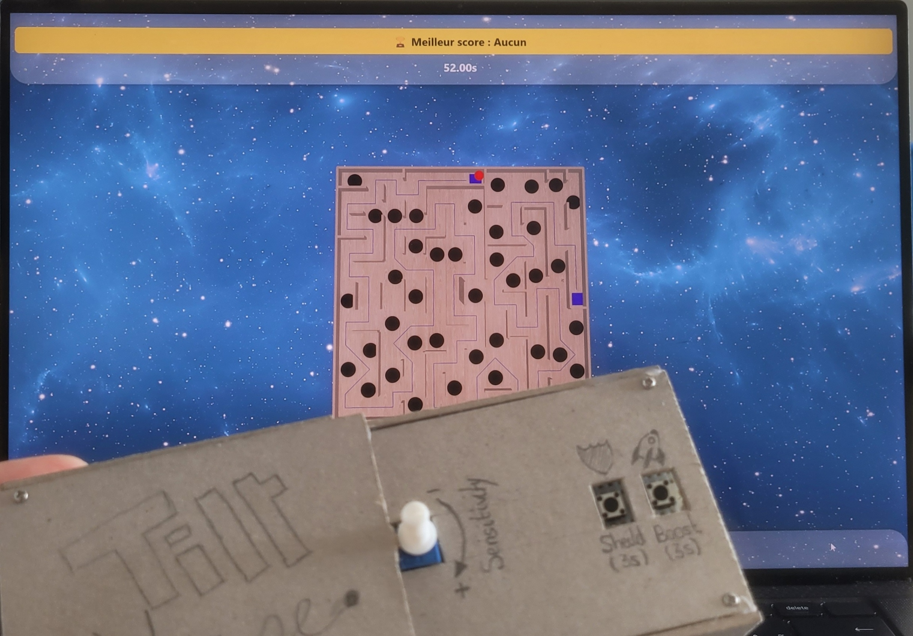
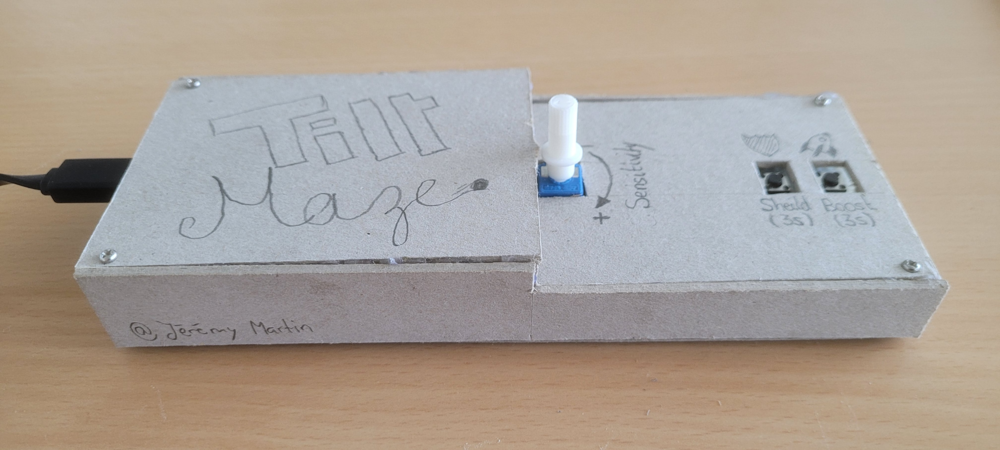
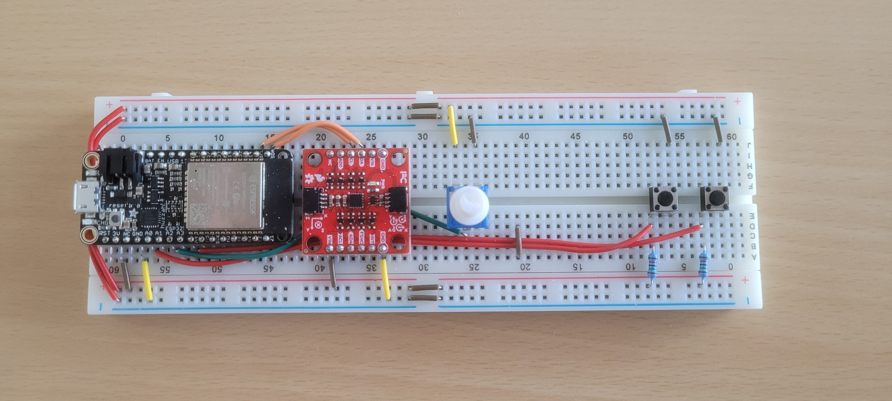

# Maze Tilt

Réalisé par `Jérémy Martin`  
Option : Objets connectés avec Arduino | 2025 | IM51-1 | COMEM+ | HEIG-VD

---

## 🎯 Description

**Maze Tilt** est un jeu de labyrinthe physique contrôlé par l'inclinaison d'une plateforme. Le joueur doit guider une bille vers l'arrivée en inclinant un plateau physique muni de capteurs. Le projet combine **ESP32 Feather**, **Three.js**, et **Vue.js** pour offrir une expérience interactive et immersive.

L'objectif était de créer une **interaction tangible** en combinant des éléments électroniques et une simulation numérique. L'expérience propose :
- Un **labyrinthe physique** détectant l'inclinaison grâce à un accéléromètre,
- Un **affichage 3D** simulant la bille et les obstacles,
- Un **système de scoring**, avec sauvegarde du meilleur score en local.

## 📚 Documentation

Retrouvez la documentation détaillée dans le dossier [docs](docs/).

## 🎥 Le projet en image
### Vidéo
Une vidéos de présentation du projet ce trouve [ici](./docs/assets/video_gh-maze_tilt.mp4)

### Photos

