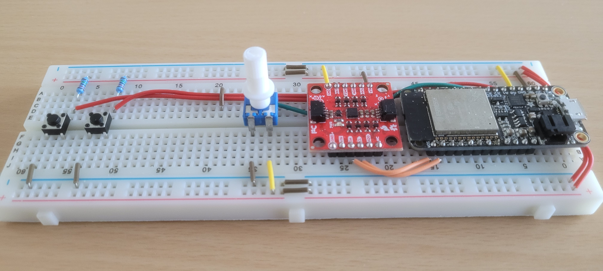
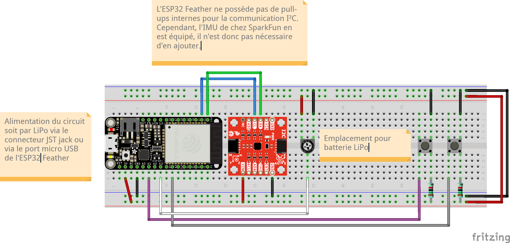

# Documentation

## Recherche et conception
L'idée du projet est inspirée des jeux traditionnels de labyrinthe en bois où l'on incline un plateau pour guider une bille vers la sortie. J'ai voulu numériser cette interaction tout en conservant une expérience physique.

### Genèse du projet et pivots
À la base, je souhaitais réaliser un cube de LED 8x8x8. J'avais même développé une simulation fonctionnelle avec P5.js, permettant de visualiser et animer le cube de la même manière que l'électronique réelle. Seule différence : le rendu était un peu plus lent en raison du rafraîchissement des composants 3D.

Cependant, nous avons rencontré un problème de fournisseur, ce qui m'a forcé à revoir mon projet.

Je me suis alors tourné vers une nouvelle idée : un stylo électronique pour dessiner sur des pages web. Mon objectif était de rendre cette interaction ludique en intégrant un jeu de type "Dessiné c'est gagné", où l'utilisateur pourrait tracer des formes en l'air et interagir avec le navigateur.

Malheureusement, lors du développement, j'ai été confronté à un problème majeur avec la qualité des mesures fournies par l'IMU (9DOF). Il était impossible d'obtenir un suivi précis des mouvements dans l'espace, ce qui rendait l'utilisation du stylo totalement imprécise.

#### Comprendre le problème
J'ai pris le temps de me renseigner en profondeur sur :

Le fonctionnement des IMU (capteurs inertiels 9DOF) et leurs limites en termes de précision,
Les technologies utilisées dans les manettes de VR (HTC Vive, Oculus, etc.), pour comprendre comment elles parviennent à offrir un suivi précis du mouvement malgré les contraintes matérielles. Ces recherches m’ont permis de mieux cerner pourquoi mon projet ne fonctionnait pas comme prévu.
🚀 Dernier pivot Face à ces difficultés, j'ai décidé de changer complètement de concept, tout en conservant l'électronique que j'avais préparée pour le stylo (notamment le gyroscope).

Le gyroscope fonctionnant bien, j'ai cherché une idée ludique, faisable dans le temps restant (~3 jours), et interactive. C'est ainsi que j'ai abouti à Maze Tilt, un labyrinthe numérique contrôlé par l’inclinaison d’un plateau physique.

### Projets similaires / Inspirations :
- DoodleAir - Stylo électronique pour interfaces web
À l’origine, je voulais créer un stylo numérique permettant de dessiner dans l’air et d’interagir avec des pages web. L’idée était d’utiliser un IMU (capteur inertiel 9DOF) pour suivre les mouvements et transformer ces gestes en tracés visibles sur un écran.
Point commun : Utilisation du même hardware (ESP32 + IMU) et communication via WebSocket.
Limite : La précision des capteurs s’est révélée insuffisante pour un suivi fluide, rendant l’interaction trop imprécise pour un dessin contrôlé.

- Labyrinthes en bois
Pour la création du plateau, je me suis inspiré de véritables labyrinthes en bois où l’on incline manuellement le support pour guider une bille. L’objectif était de retrouver cette sensation tactile tout en y intégrant des éléments numériques comme des obstacles dynamiques et un parcours conseillé.

- Space Invaders
Un jeu rétro simple à programmer et idéal pour expérimenter de nouvelles interactions. J’aurais très bien pu réaliser un Space Invaders où le vaisseau se contrôle par l’inclinaison de la main. L’idée aurait été de faire pivoter la main pour déplacer le vaisseau et d’incliner davantage pour déclencher des tirs. Ce concept aurait exploité l’IMU de manière intuitive et aurait probablement bien fonctionné.

- Gravity Jumper - Jeu de plateforme inversée
Ce projet utilise un IMU pour modifier la gravité en inversant la carte du jeu, ce qui m’a donné envie d’explorer davantage la détection d’inclinaison pour Maze Tilt.
Principe commun : L’IMU contrôle directement la physique du jeu en ajustant la gravité.

### Technologies :
- ESP32 Feather (Arduino) : Acquisition des données IMU et transmission via WebSocket.
- IMU 9DOF (MPU6050 - I²C) : Mesure de l'inclinaison du plateau grâce à l'accéléromètre et au gyroscope.
- I²C : Protocole utilisé pour communiquer entre l'ESP32 et l'IMU.
- Vue.js + Three.js : Rendu et simulation 3D du labyrinthe.
- Node.js + WebSockets : Relais des données entre l’ESP32 et l’interface web.
- HTML / CSS : Interface utilisateur et affichage des scores.

---

## Circuit électronique
Le projet repose sur un ESP32 qui communique avec un capteur IMU (MPU6050) via I²C pour mesurer l'inclinaison du plateau.

### Composants clés
- Adafruit HUZZAH32 - ESP32 Feather → Microcontrôleur gérant l'acquisition des données et la transmission via WiFi/Bluetooth. L'ESP32 transmettra les données en tant que client WebSocket. Il se connectera au serveur web, qui gérera la transmission des informations vers le frontend. Pourquoi cette architecture ? Parce qu'elle permettrait de faire passer toutes les données par un seul serveur.
  - [Datasheet](./assets/datasheets/adafruit-huzzah32-esp32-feather.pdf)
  - [Product page](https://learn.adafruit.com/adafruit-huzzah32-esp32-feather?view=all)
- SparkFun 9DoF IMU Breakout - ICM-20948 (Qwiic) → Accéléromètre + gyroscope pour détecter le mouvement du plateau.
  - [Datasheet](./assets/datasheets/DS-000189-ICM-20948-v1.3.pdf)
  - [Product page](https://www.sparkfun.com/sparkfun-9dof-imu-breakout-icm-20948-qwiic.html)
  - [HookUp Guide](https://learn.sparkfun.com/tutorials/sparkfun-9dof-imu-icm-20948-breakout-hookup-guide#resources-and-going-further)

### Schéma

### BOM

| Réf | Composant      | Quantité | Description                            | Fournisseur / Lien                                            |
| --- | -------------- | -------- | -------------------------------------- | ------------------------------------------------------------- |
| 1   | Adafruit HUZZAH32 - ESP32 Feather                          | 1        | ESP32 WROOM module, quick work of WiFi and Bluetooth  | [Adafruit](https://learn.adafruit.com/adafruit-huzzah32-esp32-feather?view=all) |
| 2   | SparkFun 9DoF IMU Breakout - ICM-20948 (Qwiic)     | 1        | I2C and SPI enabled 9-axis motion (Gyroscope, Compass, Accelerometer) | [SparkFun](https://www.sparkfun.com/sparkfun-9dof-imu-breakout-icm-20948-qwiic.html)                                                     |
| 2   | Potentiomètre     | 1 | 10kΩ                  |                                                     |
| 2   | Boutons-pressoirs     | 2 | Plaque de prototypage                  |    |
| 2   | Résistances     | 2 | Pull-ups 15kΩ pour les boutons pressoirs                  |      |
| 2   | Breadboard     | 1 | Plaque de prototypage                  |     |

## Programme

`Quelques notes sur des le code, des particularités, sa structure, l'usage de libs particulières, etc.`

Le projet est structuré en deux grandes parties :

- Firmware (ESP32 - Arduino)
  - Acquisition des données de l'IMU (ICM-20948) : Lecture des valeurs de l’accéléromètre et du gyroscope pour mesurer l'inclinaison du plateau.
  - Filtrage des données : Utilisation d'un filtre complémentaire pour améliorer la précision et éviter les dérives du gyroscope.
  - Communication WebSocket : Transmission en temps réel des données à l'interface web pour une faible latence.
- Interface Web (Vue.js + Three.js)
  - Simulation 3D du labyrinthe : Rendu interactif avec Three.js, gestion des collisions et animations.
  - Physique de la bille : Mouvement basé sur l'inclinaison mesurée, prise en compte des frottements et de la gravité.
  - Ajout de bonus : Bouclier (protection contre les trous), Boost (accélération temporaire).
  - Effets visuels :
    - Parcours suggéré avec un chemin bleu ajouté dynamiquement.
    - Effet de parallax en arrière-plan, réagissant aux mouvements du plateau.
  - Système de scoring : Sauvegarde du meilleur temps en LocalStorage.
  - UI interactive : Interface réactive pour lancer une partie, voir le score, et suivre l’état des bonus.

Au niveau du programme, il y a beaucoup à dire.

Premièrement, je pense qu'on peux distinguer le programme en 3 parties:

### IoT / Capteurs pour la gestion de la manette du jeu
Cette partie concerne tout ce qui est embarqué, c’est-à-dire la manette physique utilisée pour contrôler le labyrinthe. Elle repose sur un ESP32, un capteur IMU (MPU6050, communication I²C) et des boutons physiques.

#### Points clés et découvertes
- Utilisation de l’ESP32 : Ce choix permet une communication WiFi en WebSocket. Il a cependant des contraintes matérielles, notamment la désactivation de certains GPIOs lors de l’activation du WiFi.
- Utilisation de PlatformIO : Très utile pour la gestion de projet embarqué, mais la prise en main des bibliothèques et leur gestion peut être contraignante.
- Choix des librairies :
  - WebSocket : Je voulais que l’ESP32 fonctionne comme client WebSocket et non serveur, ce qui s’est avéré plus complexe que prévu. La plupart des bibliothèques sont conçues pour faire de l’ESP32 un serveur WebSocket.
  - Solution trouvée : Après plusieurs essais, la bibliothèque Arduino WebSockets s’est révélée être la meilleure option. Elle permet une communication fluide entre l’ESP32 et le backend.
> Conseil : Si vous souhaitez utiliser WebSocket. Secure (WSS), renseignez-vous bien sur la gestion des certificats et les spécificités de l’ESP32. 

#### Gestion des erreurs et robustesse
- Déconnexion du WiFi : Mise en place d’un système de reconnexion automatique en cas de perte de connexion.
- Lecture de l’IMU : Utilisation d’un filtrage complémentaire pour stabiliser les mesures. L’IMU fonctionne bien mais reste sujet à des dérives sur le long terme.
> Toute cette partie du code se trouve ici : [Code du controller](../main/controller/)

## Backend
Le backend est minimaliste, conçu uniquement pour réceptionner et redistribuer les données envoyées par l’ESP32.

> Le script de backend se trouve ici : [Backend](../main/game/backend/)

### Technologies utilisées
- Node.js : Utilisé comme serveur WebSocket pour recevoir les données du capteur.
- WebSocket (ws) : Permet la transmission en temps réel entre l’ESP32 et le navigateur.
> Pourquoi cette architecture ?
L’ESP32 envoie ses données à un serveur WebSocket centralisé, qui redistribue ensuite les informations aux clients connectés. Ce choix permet d’envisager une évolution du projet avec un système de stockage des scores ou un mode multijoueur.

## Frontend
Le frontend est la partie qui affiche le labyrinthe et permet à l’utilisateur d’interagir avec le jeu.

### Choix technologiques
- Vue.js : Utilisé pour structurer l’application et gérer l’interface utilisateur.
- Three.js : Moteur 3D permettant de modéliser le labyrinthe et la bille.
#### Apprentissage de Three.js
Je n’avais jamais utilisé Three.js auparavant, et j’avais entendu parler de sa courbe d’apprentissage abrupte. Finalement, grâce à des expérimentations et l’aide de ChatGPT, j’ai pu rapidement progresser.  
**Points clés de l’implémentation :**
- Simulation physique de la bille avec prise en compte de la gravité et de l’inclinaison du plateau.
- Détection des collisions avec les murs et les trous.
- Ajout de fonctionnalités visuelles comme un tracé bleu du chemin optimal et un effet de parallax en arrière-plan pour renforcer l’immersion.
### Défis rencontrés
- Corrections des collisions : La boîte de collision initiale autour de la bille était carrée, ce qui causait des rebonds étranges sur les bords et les coins des murs. J’ai dû améliorer le modèle de collision en prenant en compte un rayon circulaire.
- Gestion des angles : L’une des premières versions du jeu avait des bugs où la bille restait coincée sur les coins des murs.
### Résumé de mon ressenti sur Three.js
Three.js est très axé sur la manipulation de vecteurs, ce qui le rend puissant mais aussi exigeant. Une bonne compréhension des transformations et de la géométrie est nécessaire.

> Retrouvé le code frontend via ce lien : [Frontend](../main/game/)

## Roadmap
### Reproduire le dispositif
Le projet peut être recréé en suivant ces étapes :
1. Montage électronique
  - Assembler l’ESP32, l’IMU (MPU6050) et les boutons sur une breadboard.
  - Vérifier la communication I²C entre l’ESP32 et l’IMU.
  - Tester la lecture des données d’inclinaison avec un script Arduino simple.
2. Configuration logicielle
  - Installer PlatformIO et charger le firmware de l’ESP32.
  - Configurer la connexion WebSocket avec le serveur.
  - Mettre en place un système de reconnexion automatique en cas de perte de signal.
3. Mise en place du backend
   - Installer Node.js et le package ws pour gérer le serveur WebSocket.
  - Tester la transmission des données entre l’ESP32 et le serveur.
4. Développement du frontend
  - Installer Vue.js et Three.js.
  - Générer le labyrinthe en 3D et intégrer la physique de la bille.
  - Connecter le frontend au WebSocket pour récupérer les mouvements en temps réel.
  - Ajuster les collisions et les interactions avec les obstacles.
5. Tests et calibrations
- Ajuster la sensibilité du gyroscope pour une meilleure jouabilité.
- Vérifier la précision des collisions avec les murs et les trous.
- Tester la robustesse du réseau et l’expérience utilisateur en conditions réelles.

### Difficultés rencontrées et solutions

### Limitations du projet
- Précision du capteur IMU : Malgré les filtres appliqués, il reste une légère dérive sur le long terme. Un recalibrage manuel peut être nécessaire après plusieurs minutes d’utilisation.
- Dépendance au réseau WiFi : Si la connexion est instable, il peut y avoir des retards dans la transmission des données. Une solution serait de stocker temporairement les valeurs et de les envoyer en rafale si la connexion est interrompue.
-Frontend uniquement en WebGL : Three.js permet un bon rendu 3D, mais n’est pas optimisé pour tous les navigateurs. Une version simplifiée en 2D pourrait être envisagée pour une compatibilité plus large.

### ✅ Améliorations déjà apportées
✔️ Ajout d’un indicateur pour les bonus (barre de progression).
✔️ Correction des bugs de collision avec les murs et angles du labyrinthe.
✔️ Amélioration du mouvement de la bille pour éviter les rebonds incohérents.
✔️ Ajout d’un chemin recommandé affiché sur le plateau pour guider le joueur.
✔️ Gestion des erreurs de capteur et recalibrage de l’IMU.
✔️ Optimisation des collisions : Améliorer la détection des rebonds en arrondissant la boîte de collision.

### 🔄 Améliorations possibles
🔹 Mode multijoueur : Un serveur centralisé pourrait permettre de faire des courses de labyrinthe en ligne.
🔹 Base de données pour stocker les scores : Permettrait d’ajouter un classement et un historique des meilleures performances.
🔹 Effets sonores : Ajout de feedback audio pour les collisions, les bonus et la fin de partie.
🔹 Génération procédurale de labyrinthes : Permettrait d’avoir une infinité de niveaux et d’adapter la difficulté en fonction du score du joueur.
🔹 Affichage 2D alternatif : Une version en canvas 2D pour les appareils ne supportant pas WebGL.
🔹 Intégration mobile : Optimisation pour être jouable sur smartphone avec un gyroscope interne.

## Conclusion
Le projet a été une expérience d’apprentissage enrichissante, touchant à plusieurs domaines :
- Programmation embarquée avec l’ESP32 et communication via WebSocket.
- Modélisation 3D et gestion de la physique avec Three.js.
- Structure et architecture logicielle pour rendre le projet évolutif.
Le projet pourrait être amélioré avec de nouvelles fonctionnalités comme un mode multijoueur ou une gestion avancée des scores via une base de données.

## Fichiers utiles
- [Fritzing du circuit](./controller-maze_tilt.fzz)
- [Datasheets & documentation](./assets/)
- [Liens utiles](./assets/useful_links.md)